<p align="center">
  
</p>

<p align="center">
  <a href="https://github.com/ishandutta2007/Awesome-Awesome-Awesome"></a>
  <a href="https://discord.gg/jc4xtF58Ve"></a>
  <a href="https://github.com/ishandutta2007/Awesome-IoT-Fleet-Device-Management/blob/master/LICENSE"></a>
  <a href="https://github.com/ishandutta2007/Awesome-IoT-Fleet-Device-Management/pulls"></a>
  <a href="https://github.com/ishandutta2007"></a>
</p>

---

# ⚡ Awesome IoT Fleet & Device Management

> 🚀 **The Definitive Ecosystem Directory for Over-the-Air (OTA) Updates, Fleet Orchestration, Remote Diagnostics, and Self-Hosted Device Management Platforms.**

Welcome to the **Awesome IoT Fleet & Device Management** index! This curated knowledge base helps IoT engineers, embedded software developers, solution architects, and DevOps teams discover, evaluate, and deploy production-grade software solutions for provisioning, updating, monitoring, and securing connected device fleets at scale.

Whether you are managing **embedded Linux SBCs** (Raspberry Pi, Yocto, Ubuntu Core), **constrained microcontrollers** (ESP32, STM32, Nordic nRF), **cellular IoT gateways**, or **dedicated Android/iOS hardware**, this repository covers both leading commercial SaaS platforms and robust open-source projects.

---

## 📌 Table of Contents

- [📊 Sector Overview & Market Size](#-sector-overview--market-size)
- [🌐 SaaS & Managed Hosted Platforms](#-saas--managed-hosted-platforms)
- [⚡ Open-Source GitHub Projects](#-open-source-github-projects)
  - [⭐ Top Open-Source Repositories (Sorted by Stars)](#-top-open-source-repositories-sorted-by-stars)
  - [🛠️ Architecture & Integration Guide](#-architecture--integration-guide)
- [🤝 How to Contribute](#-how-to-contribute)
- [🔒 Security & Best Practices](#-security--best-practices)
- [📈 Star History](#-star-history)
- [💖 Support & Sponsorship](#-support--sponsorship)
- [📄 License](#-license)

---

## 📊 Sector Overview & Market Size

> **Market Valuation & Dynamics (2026)**: The global **IoT Device Management market** is currently valued at approximately **USD $8.8 Billion to $10.5 Billion** and is projected to surpass **USD $40 Billion – $80 Billion by 2032+** (growing at a CAGR of ~28–32%). The sector is **moderately fragmented**: major cloud hyperscalers (*AWS IoT*, *Azure IoT*) capture large enterprise workloads, while agile, specialized platforms (*BalenaCloud*, *Mender*, *Particle*, *Memfault*, *Esper*) thrive by offering deep end-to-end OS, container, hardware, and OTA update specializations rather than a single "winner-take-all" monopoly.

---

## 🌐 SaaS & Managed Hosted Platforms

The commercial IoT fleet management landscape offers turnkey cloud infrastructure, automated OTA deployment pipelines, global multi-region telemetry, and enterprise support SLAs. Platforms below are **sorted in descending order by company valuation / financial scale**.

| Platform 🚀 | Key Focus & Description 📝 | Company Size / Valuation 🏛️ | Starting Pricing Tier 💰 | Free Tier / Trial Limits 🎁 |
| :--- | :--- | :--- | :--- | :--- |
| **[Azure IoT Hub](https://azure.microsoft.com/en-us/products/iot-hub/)** | Managed cloud service for secure device-to-cloud messaging, device twins, jobs, and firmware updates. Ideal for Microsoft enterprise workloads. | **~$3.9 Trillion Market Cap** (Microsoft; $331.8B annual revenue) | **$10.00/month** per unit (Basic B1, 400k msgs/day) or **$25.00/month** (Standard S1) | **Free F1 Tier**: Up to 500 registered devices & 8,000 messages/day free forever (1 hub per subscription) |
| **[AWS IoT Device Management](https://aws.amazon.com/iot-device-management/)** | Onboard, organize, monitor, and remotely manage connected devices at scale with fleet indexing, secure tunneling, and over-the-air (OTA) updates. | **~$2.1 Trillion Market Cap** (Amazon; $128.7B AWS annual revenue) | **$0.10/device** bulk registration, **$0.003/remote action**, **$0.25/1M** index updates | **50 remote actions/month** free for first 12 months (plus up to $200 AWS Free Tier credits) |
| **[Canonical Ubuntu Core](https://ubuntu.com/core)** | Transactional, snap-based OS with containerized applications and enterprise device fleet security management for embedded Linux. | **~$1.5B – $2.0B Valuation** ($345M annual revenue) | Base OS is **$0 (Open Source)**; Ubuntu Pro for IoT support from **$25.00/device/year** (~$2.08/dev/mo) | **Free forever for up to 5 devices** (personal & community use with Ubuntu Pro) |
| **[Tuya Smart](https://www.tuya.com/)** | Global AIoT platform providing cloud connectivity, device management, app integration, and OTA updates. Best for consumer smart devices & OEMs. | **~$1.02 Billion Market Cap** (NYSE: TUYA; $321.8M annual revenue) | Cloud Development Pack from **$300.00/year** (~$25.00/month) or **$0.001 per API call** | **1-month free trial** with 1,000 API calls/month limit for new developer accounts |
| **[Particle Cloud](https://www.particle.io/)** | Integrated IoT platform spanning cellular/Wi-Fi hardware, cloud connectivity, rules engines, and remote device fleet management. | **~$200 Million Valuation** ($50M acquisition by Digi Int'l; $20M–$40M ARR) | Growth plan from **$299.00/month** (includes up to 1,000 devices & 1,000,000 Data Ops/mo) | **Free Sandbox Plan**: Up to 100 devices and 100,000 Data Operations/month free forever |
| **[Esper](https://esper.io/)** | Dedicated Android and iOS device management (MDM/DevOps) with remote screen control, custom app pipelines, and OS updates. | **~$100M – $250M Valuation** ($102M funding raised; $60M–$100M ARR) | Genesis plan from **$2.00/device/month** (minimum 25 devices = **$50.00/month**) | **30-day free trial** with full console capabilities and up to 100 trial devices |
| **[BalenaCloud](https://www.balena.io/)** | Container-based fleet management platform enabling developers to build, deploy, and update Docker applications across edge devices. | **~$101 Million Funding Raised** ($8.3M ARR) | Prototype plan from **$99.00/month** (includes 20 devices + $1.50/device/month additional) | **First 10 devices free forever** with full balenaCloud platform capabilities |
| **[Memfault](https://memfault.com/)** | Embedded observability platform for hardware teams — monitor device health, analyze crash traces, and manage OTA updates. | **~$25 Million Funding Raised** (Acquired by Nordic Semi; $6.6M ARR) | Growth tier from **$3,495.00/month** (for up to 1,000 monthly active devices) | **First 100 hardware units free forever** (or 10 devices for Nordic hardware integration) |
| **[Mender.io](https://mender.io/)** | Managed hosted software update management server for embedded Linux devices with atomic A/B updates, rollbacks, and delta updates. | **~$15 Million Est. Valuation** ($870K ARR) | Basic plan from **$34.00/month** (for up to 50 devices) | **12-month free hosted trial for up to 10 devices** (no credit card required) |
| **[Uptane](https://uptane.org/)** | Open-source security framework standard for automotive and safety-critical OTA software updates, designed to withstand server breaches. | **Non-profit Open Standard** (Linux Foundation / JDF project) | **$0.00 (Open Standard)** — specification and reference code are free open-source | **100% Free Open Standard** hosted by Linux Foundation (unlimited devices/use) |

---

## ⚡ Open-Source GitHub Projects

IoT fleet management is a thriving open-source ecosystem. Self-hosting provides complete data sovereignty, customized protocol integration, and zero recurring vendor lock-in.

### ⭐ Top Open-Source Repositories (Sorted by Stars)

Below repositories are **sorted in descending order by GitHub Star count**. Click the star badge beside any repository to inspect its live stargazers on GitHub!

1. **[K3s](https://github.com/rancher/k3s)** [](https://github.com/rancher/k3s/stargazers)  
   *Lightweight Kubernetes designed for IoT, Edge, and ARM devices. Simple, secure binary under 100MB for orchestrating containerized edge fleets.*

2. **[ThingsBoard](https://github.com/thingsboard/thingsboard)** [](https://github.com/thingsboard/thingsboard/stargazers)  
   *Open-source IoT platform for device management, data collection, processing, and rich real-time visualization dashboards with MQTT/CoAP/HTTP.*

3. **[EMQX](https://github.com/emqx/emqx)** [](https://github.com/emqx/emqx/stargazers)  
   *Ultra-scalable open-source MQTT broker for IoT, IIoT, and connected vehicle fleets capable of handling millions of concurrent device connections.*

4. **[ESPHome](https://github.com/esphome/esphome)** [](https://github.com/esphome/esphome/stargazers)  
   *System to control ESP8266/ESP32 devices by simple configuration files and manage device fleets remotely with over-the-air (OTA) updates.*

5. **[EdgeX Foundry](https://github.com/edgexfoundry/edgex-go)** [](https://github.com/edgexfoundry/edgex-go/stargazers)  
   *Vendor-neutral open-source software platform hosted by LF Edge, providing a plug-and-play microservices framework for IoT edge computing.*

6. **[Mender Client & Server](https://github.com/mendersoftware/mender)** [](https://github.com/mendersoftware/mender/stargazers)  
   *Production-proven open-source OTA software update manager for embedded Linux devices with dual A/B partition updates and automatic rollback.*

7. **[Mongoose OS](https://github.com/cesanta/mongoose-os)** [](https://github.com/cesanta/mongoose-os/stargazers)  
   *Open-source IoT firmware development framework for ESP32, ESP8266, STM32, and CC3200 with built-in OTA updates and cloud integration.*

8. **[Eclipse hawkBit](https://github.com/eclipse-hawkbit/hawkbit)** [](https://github.com/eclipse-hawkbit/hawkbit/stargazers)  
   *Domain-independent back-end framework for rolling out software updates to constrained edge devices, featuring multi-tenancy and rollout groups.*

9. **[OpenRemote](https://github.com/openremote/openremote)** [](https://github.com/openremote/openremote/stargazers)  
   *100% open-source IoT device management and visualization platform targeted at smart cities, energy management, and smart building fleets.*

10. **[SWUpdate](https://github.com/sbabic/swupdate)** [](https://github.com/sbabic/swupdate/stargazers)  
    *Flexible Linux embedded update agent supporting A/B partition updates, single-copy restoration, and integration with Eclipse hawkBit.*

11. **[RAUC](https://github.com/rauc/rauc)** [](https://github.com/rauc/rauc/stargazers)  
    *Lightweight, safe, and secure update framework for embedded Linux, specializing in A/B updates, cryptographic verification, and rollback.*

12. **[Magistrala (Mainflux)](https://github.com/absmach/magistrala)** [](https://github.com/absmach/magistrala/stargazers)  
    *High-performance, Go-based, cloud-native open-source IoT platform offering fine-grained identity, device management, and security policies.*

13. **[ChirpStack](https://github.com/chirpstack/chirpstack)** [](https://github.com/chirpstack/chirpstack/stargazers)  
    *Open-source LoRaWAN Network Server stack providing device management, gateway orchestration, and payload decryption for LoRaWAN fleets.*

14. **[OpenBalena](https://github.com/balena-io/open-balena)** [](https://github.com/balena-io/open-balena/stargazers)  
    *Open-source backend services for managing balenaOS device fleets, enabling self-hosted container deployments and remote SSH access.*

15. **[Pantavisor](https://github.com/pantavisor/pantavisor)** [](https://github.com/pantavisor/pantavisor/stargazers)  
    *Containerized Linux system architecture for embedded devices using LXC containers for modular firmware, updates, and device management.*

16. **[NervesHub](https://github.com/nerves-hub/nerves_hub_web)** [](https://github.com/nerves-hub/nerves_hub_web/stargazers)  
    *Open-source platform for secure OTA firmware updates and fleet management of Elixir/Nerves embedded devices, proven at scale.*

17. **[NAOS](https://github.com/256dpi/naos)** [](https://github.com/256dpi/naos/stargazers)  
    *Standardized remote management framework and CLI tools specifically for ESP32 microcontroller fleets, featuring live log tailing and updates.*

---

### 🛠️ Architecture & Integration Guide

Building a custom open-source IoT fleet management stack involves layering specialized modules:

```
┌────────────────────────────────────────────────────────────────────────┐
│                   IoT Fleet Orchestration Layer                        │
│            (ThingsBoard / Magistrala / OpenRemote / K3s)               │
├────────────────────────────────────────────────────────────────────────┤
│                   OTA Software Update Engine                           │
│        (Eclipse hawkBit / Mender Server / NervesHub / OpenBalena)      │
├────────────────────────────────────────────────────────────────────────┤
│                 Device Agent & Firmware OS Layer                       │
│    (SWUpdate / RAUC / Mender Client / ESPHome / NAOS / Mongoose OS)    │
└────────────────────────────────────────────────────────────────────────┘
```

---

## 🤝 How to Contribute

Contributions are warmly welcomed! Help make this ecosystem resource even better:

1. **Fork** this repository.
2. Create a feature branch (`git checkout -b feature/new-iot-tool`).
3. Add your entry to `README.md` keeping formatting consistent.
4. Ensure SaaS tools include pricing/free tier details and open-source tools include their GitHub link.
5. Submit a **Pull Request** with a brief summary of the project.

Check out our curated meta-list: [ **Awesome-Awesome-Awesome**](https://github.com/ishandutta2007/Awesome-Awesome-Awesome) for more tech collections!

---

## 🔒 Security & Best Practices

- 🔐 **Cryptographic Firmware Signing**: Always sign firmware artifacts (using RSA/ED25519) before sending them via OTA pipelines. Unsigned updates present severe remote code execution risks.
- 🔄 **Atomic Rollbacks**: Ensure device update agents use dual A/B partition schemes (Mender, RAUC, SWUpdate) so unbootable updates automatically revert to the safe operating system.
- 🛡️ **Mutual TLS (mTLS)**: Mandate per-device X.509 client certificates for device authentication to prevent unauthorized device spoofing.
- 🌐 **NAT & Firewall Traversal**: Use pull-based architecture (MQTT / WebSockets) so devices initiate connections outbound without exposing inbound ports to the public internet.

---

## 📈 Star History

[](https://star-history.dera.page/#ishandutta2007/Awesome-IoT-Fleet-Device-Management&type=date&legend=top-left)

---

## 💖 Support & Sponsorship

Thank you for exploring the **Awesome IoT Fleet & Device Management** ecosystem! If this repository helped you evaluate IoT platforms, architect OTA update pipelines, or manage connected device fleets:

- ⭐️ **Star** this repository to increase its visibility!
- 🔀 **Fork** and contribute your favorite open-source tools or SaaS platforms.
- 📢 **Share** with your network, IoT engineering team, or embedded community.

<p align="center">
  <a href="https://github.com/sponsors/ishandutta2007">
    
  </a>
  <a href="https://github.com/sponsors/ishandutta2007">
    
  </a>
</p>

---

## 📄 License

Distributed under the **MIT License**. See `LICENSE` for more details.

*Crafted with ❤️ for IoT engineers, embedded developers, and fleet operations teams worldwide.*
